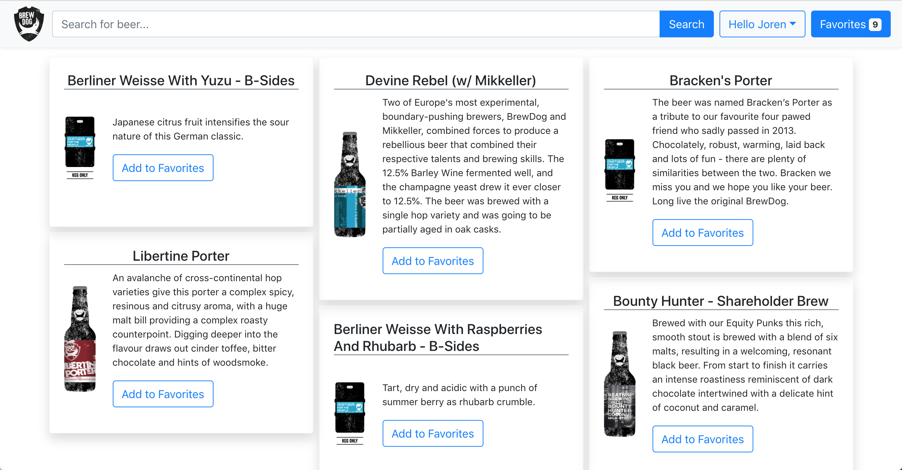

# Beer-Search
# Usage
* Using Postgres, run the command "psql -U postgres -d mydb -f configure.sql", but with your username and desired database to create the tables. 
* Then, go to the "backend" directory.
  * Set environment variables with the relevant database information.
    * eg. $ PGUSER=dbuser \
          PGHOST=database.server.com \
          PGPASSWORD=secretpassword \
          PGDATABASE=mydb \
          PGPORT=3211
  * Now, run "npm index.js".
* Finally, open another terminal window, navigate to the "frontend" directory and run "npm start".

# Screenshots

----
&nbsp;
&nbsp;
&nbsp;

----
&nbsp;
&nbsp;
&nbsp;

----
&nbsp;
&nbsp;
&nbsp;

----

